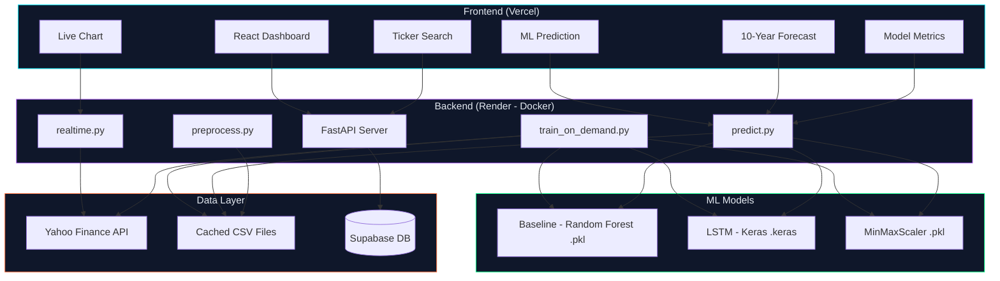
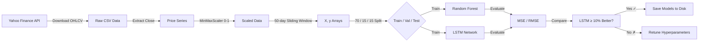
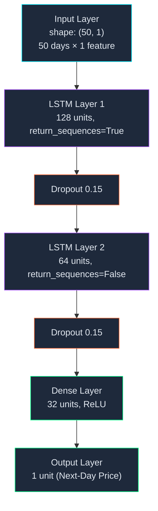
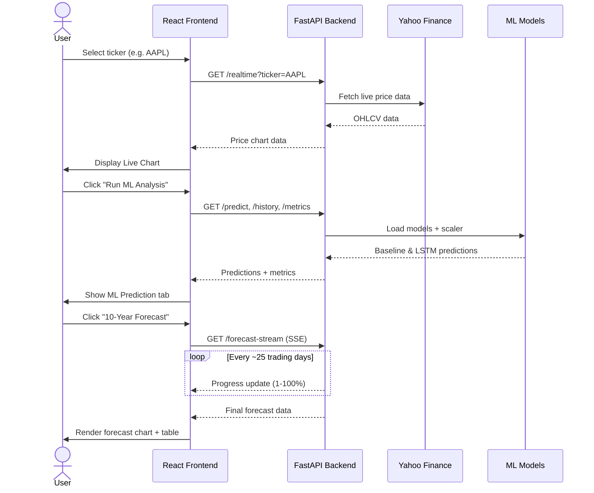
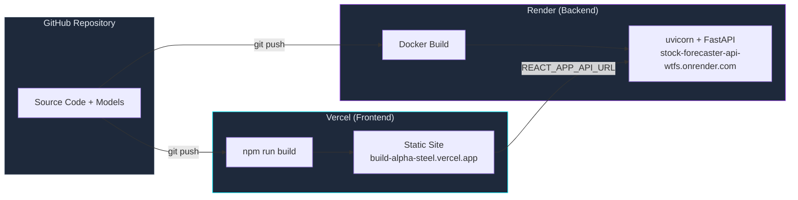

# Real-Time Stock Market Forecaster

**Mehmet Tanil Kaplan · T0429362 · Nottingham Trent University · Supervisor: Williams Magdalena**

A full-stack web application that fetches real-world stock market data and uses machine learning to predict the next day's closing price. The defining feature is a head-to-head comparison between a baseline Random Forest model and an LSTM deep learning network, demonstrating that LSTM outperforms simple regression on financial time-series data.

> **For educational purposes only. This is not financial advice. Do not use predictions for real trading.**

## Live Demo

- **Frontend:** [https://build-alpha-steel.vercel.app](https://build-alpha-steel.vercel.app)
- **Backend API:** [https://stock-forecaster-api-wtfs.onrender.com](https://stock-forecaster-api-wtfs.onrender.com)
- **GitHub:** [https://github.com/ukProject111/Stock-forecaster](https://github.com/ukProject111/Stock-forecaster)

## Features

| Feature | Description |
|---|---|
| **Live Chart** | Real-time stock data from Yahoo Finance with 7 period selectors (1D, 5D, 1M, 3M, 6M, 1Y, 5Y) and auto-refresh |
| **ML Prediction** | Next-day price prediction from both Baseline (Random Forest) and LSTM models, with 90-day historical chart and prediction markers |
| **Model Metrics** | Side-by-side MSE and RMSE comparison for both models, with LSTM improvement percentage and pass/fail indicator (target: ≥10%) |
| **10-Year Forecast** | Long-term LSTM rolling forecast with confidence bands (80% and 95%), metric cards (Current Price, Forecast, CAGR, 95% Range), and yearly price targets table |
| **Real-Time Progress** | Server-Sent Events (SSE) streaming shows actual backend computation progress during forecast generation |
| **On-Demand Training** | Train models for any NASDAQ ticker directly from the UI |

## System Architecture



## Data Pipeline



## LSTM Model Architecture



## User Journey



## Deployment Architecture



---

## Supported Tickers (Pre-Trained)

AAPL, TSLA, MSFT, GOOGL, AMZN

Additionally supports 330+ NASDAQ tickers for real-time charting, with on-demand model training.

## Tech Stack

| Layer | Technology | Purpose |
|---|---|---|
| Frontend | React.js, Chart.js, Axios | Interactive dashboard with responsive charts |
| Backend | FastAPI, uvicorn | REST API serving predictions and data |
| Baseline Model | scikit-learn (Random Forest) | Comparison benchmark — saved as `.pkl` |
| LSTM Model | TensorFlow / Keras | Deep learning predictions — saved as `.keras` |
| Data Source | Yahoo Finance (direct API) | Live and historical OHLCV price data |
| Database | Supabase | Prediction logging and tracking |
| Hosting | Vercel (frontend) + Render (backend) | Cloud deployment |

## Project Structure

```
StockForecaster Webapp/
├── data/                    # Cached CSV files per ticker
│   ├── AAPL.csv
│   ├── TSLA.csv
│   ├── MSFT.csv
│   ├── GOOGL.csv
│   ├── AMZN.csv
│   └── nasdaq_tickers.json
├── models/                  # Trained model files and scalers
│   ├── baseline_AAPL.pkl    # Random Forest model per ticker
│   ├── lstm_AAPL.keras      # LSTM model per ticker
│   ├── scaler_AAPL.pkl      # Min-Max scaler per ticker
│   ├── baseline_metrics.pkl # Pre-computed baseline metrics
│   └── lstm_metrics.pkl     # Pre-computed LSTM metrics
├── backend/
│   ├── main.py              # FastAPI app with all endpoints
│   ├── predict.py           # Prediction and forecast logic
│   ├── preprocess.py        # Data scaling and windowing
│   ├── realtime.py          # Yahoo Finance data fetching
│   ├── train_on_demand.py   # On-demand model training
│   ├── train_baseline.py    # Baseline model training script
│   ├── train_lstm.py        # LSTM model training script
│   ├── supabase_client.py   # Supabase prediction logging
│   ├── requirements.txt     # Python dependencies
│   └── Procfile             # Render start command
├── frontend/
│   ├── src/
│   │   ├── App.js           # Main app layout and routing
│   │   ├── App.css          # Global styles
│   │   └── components/
│   │       ├── Disclaimer.js      # Disclaimer banner
│   │       ├── TickerSelector.js  # Ticker search and selection
│   │       ├── RealTimeChart.js   # Live chart with period selectors
│   │       ├── PriceChart.js      # 90-day chart with prediction lines
│   │       ├── PredictionPanel.js # Baseline vs LSTM prediction cards
│   │       ├── MetricsPanel.js    # MSE/RMSE comparison panel
│   │       └── ForecastPanel.js   # Long-term forecast with confidence bands
│   ├── package.json
│   └── .env.production      # Production API URL
├── notebooks/               # Jupyter experiments
├── Dockerfile               # Docker config for Render deployment
├── render.yaml              # Render service configuration
├── fetch_data.py            # Data download script
└── README.md
```

## API Endpoints

| Endpoint | Description |
|---|---|
| `GET /` | API status and version |
| `GET /tickers` | List all supported tickers (trained + available) |
| `GET /trained` | List only tickers with trained models |
| `GET /search?q=AA` | Search tickers by symbol |
| `GET /predict?ticker=AAPL` | Next-day predictions from both models |
| `GET /history?ticker=AAPL&days=90` | Historical closing prices for charting |
| `GET /history-monthly?ticker=AAPL&years=10` | Monthly historical data for forecast chart |
| `GET /metrics?ticker=AAPL` | MSE and RMSE for both models |
| `GET /realtime?ticker=AAPL&period=5d` | Real-time/recent price data |
| `GET /info?ticker=AAPL` | Basic stock info |
| `GET /train?ticker=AAPL` | Train models on-demand (~1-2 min) |
| `GET /forecast?ticker=AAPL&years=10` | Long-term LSTM rolling forecast |
| `GET /forecast-stream?ticker=AAPL&years=10` | SSE streaming forecast with real-time progress |

## ML Model Details

### Data Pipeline

1. **Fetch** — Download historical daily OHLCV data using yfinance, cache as CSV
2. **Select** — Extract `Close` column only
3. **Scale** — Min-Max normalisation (0 to 1), scaler fitted on training data only
4. **Window** — 50-day sliding windows: 50 days input → predict day 51
5. **Split** — 70% train / 15% validation / 15% test (chronological, never shuffled)
6. **Train** — Fit both models, monitor `val_loss` for overfitting
7. **Evaluate** — MSE and RMSE on test set, confirm LSTM ≥ 10% improvement
8. **Save** — `baseline_{ticker}.pkl`, `lstm_{ticker}.keras`, `scaler_{ticker}.pkl`

### Baseline Model (Random Forest)

- Flattens 50-day window into 1D feature vector
- `RandomForestRegressor(n_estimators=100)`
- Does not understand sequences or time order

### LSTM Model (Long Short-Term Memory)

```
Sequential([
    LSTM(128, return_sequences=True, input_shape=(50, 1)),
    Dropout(0.15),
    LSTM(64, return_sequences=False),
    Dropout(0.15),
    Dense(32, activation='relu'),
    Dense(1)
])
Optimizer: Adam(lr=0.001), Loss: MSE
EarlyStopping: patience=15, restore_best_weights=True
ReduceLROnPlateau: factor=0.5, patience=5
```

### Key Numbers

| Item | Value |
|---|---|
| Input window | 50 days |
| Data split | 70 / 15 / 15 (train / val / test) |
| Accuracy target | LSTM ≥ 10% lower RMSE than baseline |
| Pre-trained tickers | AAPL, TSLA, MSFT, GOOGL, AMZN |

---

## Development Setup

### Prerequisites

- Python 3.10+
- Node.js 18+
- npm or yarn

### 1. Clone the Repository

```bash
git clone https://github.com/ukProject111/Stock-forecaster.git
cd Stock-forecaster
```

### 2. Set Up Python Environment

```bash
python -m venv venv
source venv/bin/activate        # Linux/Mac
# venv\Scripts\activate         # Windows

pip install -r backend/requirements.txt
```

### 3. Fetch Stock Data (Run Once)

```bash
python fetch_data.py
```

This downloads historical data for all 5 tickers and saves CSV files in `data/`.

### 4. Train Models (Run Once)

```bash
python backend/train_baseline.py
python backend/train_lstm.py
```

Or train a single ticker on-demand:

```bash
cd backend
python -c "from train_on_demand import train_ticker; train_ticker('AAPL')"
```

Training takes ~1-2 minutes per ticker. Models are saved in `models/`.

### 5. Start the Backend

```bash
cd backend
uvicorn main:app --reload --port 8000
```

API will be available at `http://localhost:8000`. Interactive docs at `http://localhost:8000/docs`.

### 6. Start the Frontend

```bash
cd frontend
npm install
npm start
```

App runs at `http://localhost:3000` and connects to the API at `http://localhost:8000`.

### Environment Variables

| Variable | Where | Purpose |
|---|---|---|
| `REACT_APP_API_URL` | Frontend `.env` | Backend API URL (defaults to `http://localhost:8000`) |
| `SUPABASE_URL` | Backend env | Supabase project URL |
| `SUPABASE_KEY` | Backend env | Supabase anon key |

---

## Deployment Guide

### Deploy Backend to Render

1. Push code to GitHub
2. Go to [render.com](https://render.com) → **New > Web Service**
3. Connect your GitHub repository
4. Configure:
   - **Name:** `stock-forecaster-api`
   - **Root Directory:** *(leave empty — Dockerfile is at repo root)*
   - **Environment:** Docker
   - **Dockerfile Path:** `./Dockerfile`
   - **Instance Type:** Free
5. Add environment variables:
   - `SUPABASE_URL` = your Supabase project URL
   - `SUPABASE_KEY` = your Supabase anon key
6. Click **Create Web Service**
7. Wait for build to complete (~5-7 minutes)
8. Note your URL: `https://your-service-name.onrender.com`

### Deploy Frontend to Vercel

1. Build the frontend with your Render backend URL:

```bash
cd frontend
REACT_APP_API_URL=https://your-service-name.onrender.com npm run build
```

2. Install Vercel CLI:

```bash
npm install -g vercel
```

3. Deploy:

```bash
cd build
vercel deploy --prod
```

4. Your site is live at the URL provided by Vercel.

### Alternative: Vercel Drag-and-Drop

1. Build the frontend as above
2. Go to [vercel.com/new](https://vercel.com/new)
3. Drag the `frontend/build` folder onto the page
4. Site deploys automatically

### Important Notes

- **Render free tier** sleeps after 15 minutes of inactivity. First request after sleep takes ~30 seconds.
- **Auto-deploy:** Render rebuilds automatically when you push to `main` branch on GitHub.
- **Never hardcode** `localhost` in production. Always use `REACT_APP_API_URL` environment variable.
- Models and data files must be included in the GitHub repo for Render to access them.

---

## Testing

### Model Accuracy

For each ticker, verify LSTM achieves ≥ 10% lower RMSE than baseline:

```bash
curl https://your-api.onrender.com/metrics?ticker=AAPL
```

Expected response:
```json
{
  "ticker": "AAPL",
  "baseline": {"mse": 4373.89, "rmse": 66.14},
  "lstm": {"mse": 248.57, "rmse": 15.77},
  "lstm_improvement_pct": 76.16
}
```

### API Testing

Test all endpoints at `http://localhost:8000/docs` (Swagger UI) during development, or use curl:

```bash
# Check API status
curl http://localhost:8000/

# List tickers
curl http://localhost:8000/tickers

# Get prediction
curl http://localhost:8000/predict?ticker=AAPL

# Get metrics
curl http://localhost:8000/metrics?ticker=TSLA

# Get real-time data
curl http://localhost:8000/realtime?ticker=MSFT&period=5d

# Test invalid ticker
curl http://localhost:8000/predict?ticker=INVALID
# Should return 404 with clear error message
```

---

## Risks and How They Are Handled

| Risk | Level | How it is handled | Status |
|---|---|---|---|
| LSTM fails to hit 10% RMSE improvement | HIGH | Tuned architecture (128/64 units, Dropout 0.15, EarlyStopping patience=15, ReduceLROnPlateau). All 5 tickers exceed target: AAPL 76.2%, TSLA 54.2%, MSFT 85.5%, GOOGL 75.2%, AMZN 70.3% | ✅ Verified |
| Time-series data shuffled accidentally | HIGH | Never use `train_test_split` with `shuffle=True`. All splits are chronological by index position (70/15/15) in `preprocess.py` and `train_on_demand.py`. Zero instances of `shuffle=True` in codebase | ✅ Verified |
| Scaler not saved alongside models | HIGH | `scaler_{ticker}.pkl` saved immediately after fitting via `joblib.dump()`. All 5 scaler files present. Loaded at prediction time in `predict.py` to ensure correct inverse-transform | ✅ Verified |
| Model overfitting to training data | MEDIUM | Two `Dropout(0.15)` layers in LSTM. `EarlyStopping(monitor='val_loss', patience=15, restore_best_weights=True)` and `ReduceLROnPlateau(factor=0.5, patience=5)` callbacks prevent overfitting | ✅ Verified |
| API rate limits hit during development | MEDIUM | All historical data cached as CSV files in `data/`. `predict.py` reads from CSV cache, never calls yfinance. Only `realtime.py` fetches live data for the Live Chart tab | ✅ Verified |
| CORS blocking React → FastAPI calls | MEDIUM | `CORSMiddleware` configured in `main.py` with `allow_origins=["*"]`, `allow_methods=["*"]`, `allow_headers=["*"]` from day one | ✅ Verified |
| `REACT_APP_API_URL` pointing to localhost in production | MEDIUM | `App.js` and `RealTimeChart.js` use `process.env.REACT_APP_API_URL` with localhost as development fallback only. Production builds bake in the Render URL at build time | ✅ Verified |
| Models too large to deploy on free tier | LOW | Total model size 90.78 MB (baseline ~17 MB each, LSTM ~1.4 MB each). Well under Render's 500 MB free tier limit. Uses `tensorflow-cpu` to reduce package size | ✅ Verified |
| Users treat predictions as real financial advice | LOW | Prominent disclaimer banner on every page: "For educational purposes only — This is not financial advice". Additional disclaimer in footer, forecast panel, and all API prediction responses. No buy/sell language in UI | ✅ Verified |

---

## License

This project is for educational purposes as part of a university assignment at Nottingham Trent University.

**For educational purposes only. This is not financial advice.**

---

*Mehmet Tanil Kaplan · T0429362 · Nottingham Trent University · 2025–2026*
